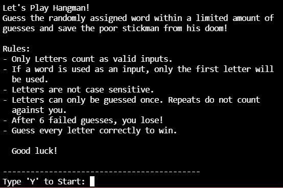

## Table of contents
* [General info](#general-info)
* [Technologies](#technologies)
* [Setup](#setup)
* [Images](#images)

## General info
This project is a terminal game project where I decided to learn how to make the game of Hangman. Be assigned a random word and guess away with letters (and only letters!) to discover the correct word before leading a poor stickman to drawing his last breath! 

Within this project, I reestablished my fundamentals of python by practices loops and instantiating functions correctly, while working on problem solving skills to make everything work as intended. Troubles I faced were ensuring that guesses could only be letters and making sure that a word with a hyphen would be represented properly within the terminal alongside the underscores. I also learned how to use images in markdown!
	
## Technologies
Project is created with:
* Python 3.9.7

	
## Setup
Run in a prefered IDE such as [Visual Studio Code](https://code.visualstudio.com/)

## Images
View the rules before you start!

Play a friendly game of Hangman in your terminal!

Look! You've won!

